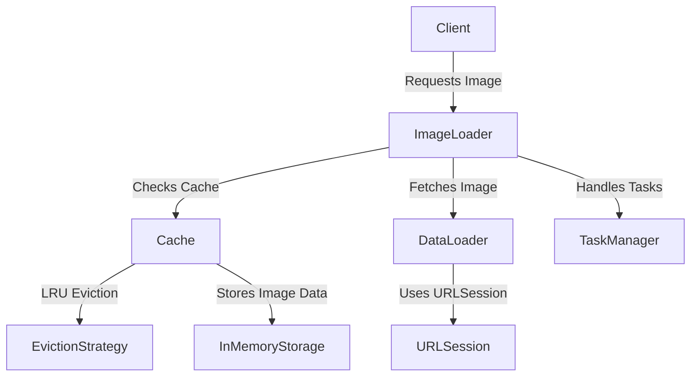

# ImageLoader

An asynchronous image loader with cache. It fetches images asynchronously and store them in a In Memory cache.
The cache uses an LRU (Least Recently Used) eviction strategy to manage memory efficiently.

**Flow**

**Missed improvements**

- Extension on Image types for better usaged of imageloader
- iOS/MacOS app to test the flow, Integration tests are included.
